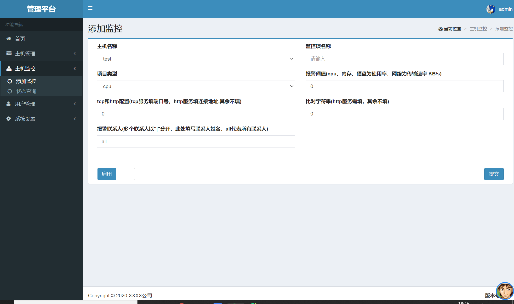
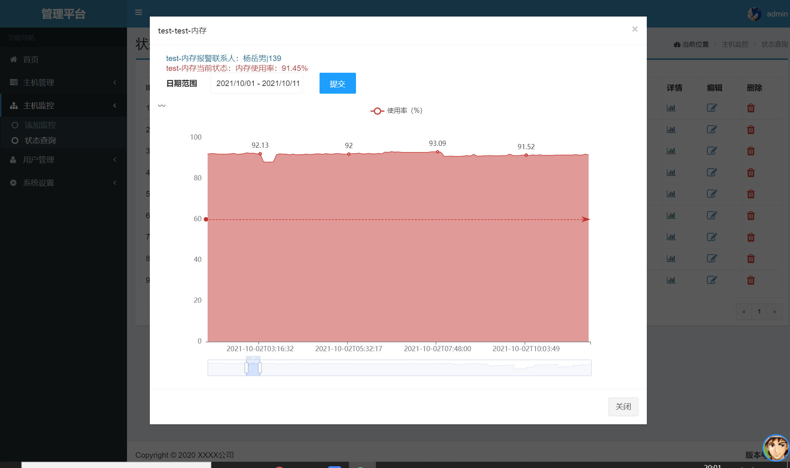
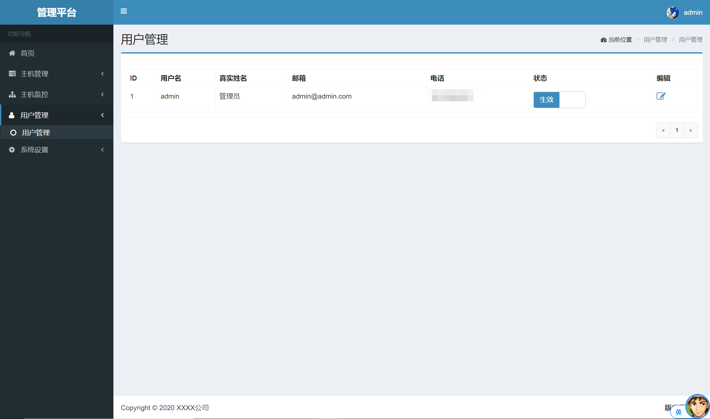

# opsmonitor
## 简介
opsmonitor是一个简单的服务器监控系统，本项目fork于flask-adminlte-handler  
开发opsmonitor的原因是，现有的开源监控服务如：nagios、cacti等，配置繁琐、安装复杂；
开发这个系统的目的就是为了解决繁琐的配置问题，opsmonitor主体功能现都已完成，可以满足基本
的监控需求。  
opsmonitor只适用于小型系统的监控，目前的opsmonitor对于监控项目过多的系统
会有性能问题，建议监控主机数少于20台，并且监控项数据少于100个。 

### 注意
本系统用户管理界面的switch开关不起作用

## 使用的技术
1. Web框架使用Flask，默认Jinja模版
2. ORM框架使用Peewee
3. 前端套用基于BootStrap的AdminLTE模板，也使用了少量的layui
4. 使用paramiko通过ssh通道获取主机硬件信息

## 系统截图
- 登录页  


- 主页  


- 添加主机页  
  

- 主机列表页  

  
- 添加监控页

  
- 监控项列表页

  
- 监控项详情页

  
- 登录用户管理页

  
- 报警配置页

  
- 报警列表页

  
- 全局配置页（邮件smtp信息配置）


## 第三方依赖
- peewee
- pymysql
- flask
- flask-script
- flask-wtf
- flask-login
- paramiko
- pyecharts
- requests


## 环境配置
### venv虚拟环境安装配置
```
sudo pip3 install virtualenv
virtualenv venv
. venv/bin/activate
```

### 第三方依赖安装
```
pip3 install -r requirements.txt

```
### 系统参数配置
1. 编辑`config.py`， 修改SECRET_KEY及MySQL数据库相关参数
```
SECRET_KEY = os.environ.get('SECRET_KEY') or 'your-secret'
DB_HOST = '127.0.0.1'
DB_USER = 'foobar'
DB_PASSWD = 'foobar'
DB_DATABASE = 'foobar'
```

2. 编辑log-app.conf，修改日志路径
```
args=('/path/to/log/flask-rest-sample.log','a','utf8')
```

### 数据库初始化
1. 自动建表  
直接运行`python3 models.py`，或者导入根目录下的sql文件

2. 插入管理员用户（默认admin/admin)，如果是导入的sql文件这步可跳过
```
INSERT INTO `user` (`id`, `username`, `password`, `fullname`, `email`, `phone`, `status`)
VALUES
	(1, 'admin', 'pbkdf2:sha1:1000$Km1vdx3W$9aa07d3b79ab88aae53e45d26d0d4d4e097a6cd3', '管理员', 'admin@admin.com', '18612341234', 1);
```

### 管理应用
```
启动
chmod +x start.sh
./start.sh all
停止
chmod +x stop.sh
./stop.sh all
重启
chmod +x restart.sh
./restart.sh all

管理脚本具体用法可查看脚本帮助（./start.sh -h|./stop.sh -h|./restart.sh -h）
```


## 项目目录结构 
- /app/auth  用户认证相关代码
- /app/main  主要功能点相关代码
- /app/static  JS、CSS等静态文件
- /app/template  页面模版
- /app/models.py  Peewee模型
- /app/utils  工具包
- /app/api  数据接口  
- /conf  系统参数及日志配置
- /monitor.py 获取监控项状态文件


## 短信说明
本平台没有开发短信通知功能，如需使用请参考短信服务提供商的开发文档
阿里云：https://help.aliyun.com/document_detail/55491.html?spm=a2c4g.11186623.6.685.7da11c11pYvJGz  
百度：https://cloud.baidu.com/doc/SMS/s/gkipnj62c


## 相关学习文档
- [http://flask.pocoo.org](http://flask.pocoo.org)
- [https://flask-login.readthedocs.io](https://flask-login.readthedocs.io)
- [https://flask-script.readthedocs.io](https://flask-script.readthedocs.io)
- [https://flask-wtf.readthedocs.io](https://flask-wtf.readthedocs.io)
- [http://docs.peewee-orm.com](http://docs.peewee-orm.com)
- [https://almsaeedstudio.com/preview](https://almsaeedstudio.com/preview)
- [https://pyecharts.org/#/zh-cn/](https://pyecharts.org/#/zh-cn/)
